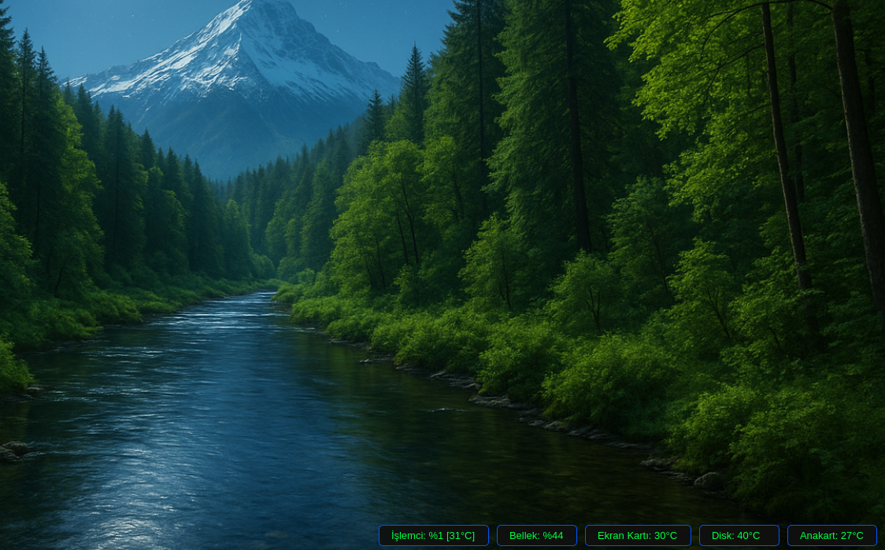

    # Sistem Gözlem

    Sistem Gözlem, CPU ve RAM kullanımını; mevcutsa donanım sıcaklıklarını küçük, çerçevesiz ve her zaman üstte kalan bir pencerede gösterir.

    ## Kurulum

    * Bağımlılıklar :  (python3-pyqt5-psutil-lm-sensors) 

    * sudo apt install python3-pyqt5 python3-psutil lm-sensors     Komutu termianele yapıştırıp kurumlum yapabilirsiniz.

    * Sistem-Gözlem-v1.deb paketini çift tıklayıp kurulum yapabilirsiniz  .   

---------------------------------------------------------------

    Terminalden Kurulum . 

    * Sistem-Gözlem-v1.deb   paketini Masaüstü ne koyun 

    *  cd ~/Masaüstü

    *  sudo dpkg -i Sistem-Gözlem-v1.deb 
    
    
    ---------------------------------------------------------------

    Uyarı ! Hardisk Görmezse  sırayla terminale Yazın
    
     echo "drivetemp" | sudo tee /etc/modules-load.d/drivetemp.conf     Enter

     lsmod | grep drivetemp               Enter
    
     sudo modprobe drivetemp               Enter

   
   Artık sürekli olarak HDD nizi görektir . 
   

    ---------------------------------------------------------------

    
  Özellikler

CPU ve RAM kullanımını anlık gösterim

CPU / GPU / Disk / Anakart sıcaklıkları (varsa)

Küçük, çerçevesiz, üstte duran pencere

Sürüklenebilir konumlandırma

Sağ tık menüsü ile çıkış
